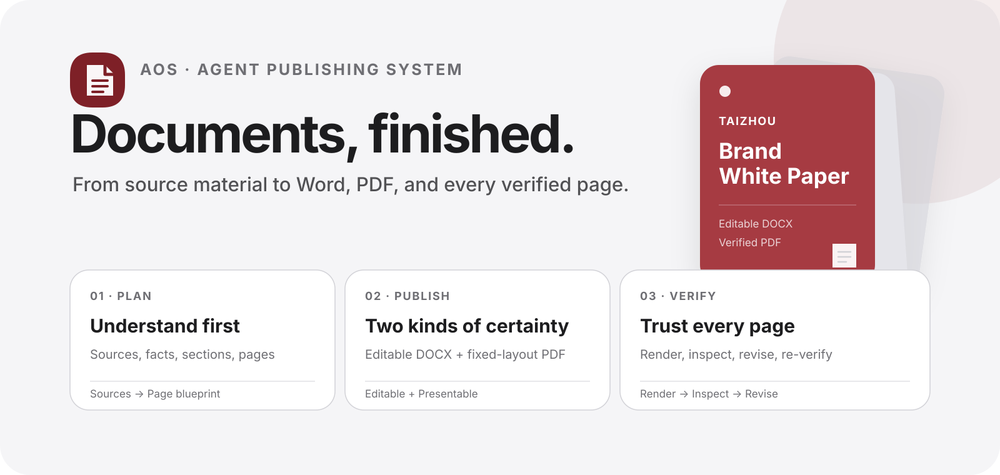

<div align="center">
  
  <h1>AOS Agent Skill · Document</h1>
  <p><strong>Help agents deliver finished documents, not merely generate files.</strong></p>
  <p>Plan content · Create or revise Word · Export PDF · Inspect every page · Prepare for public release</p>
  <p>
    <a href="README.md">简体中文</a> ·
    <a href="README.en.md">English</a>
  </p>
  <p>
    <a href="https://github.com/axutse/aos-agent-skill-document/releases"></a>
    <a href="https://github.com/axutse/aos-agent-skill-document/actions/workflows/validate.yml"></a>
    <a href="LICENSE"></a>
  </p>
  <p><sub>Version 0.1.4 · Local processing · No extra API key · 中文 / English</sub></p>
</div>

---

**[See the work](#see-the-work)** · **[Capabilities](#capabilities)** · **[Choose a skill](#choose-a-skill)** · **[Start in 3 minutes](#start-in-3-minutes)** · **[Use cases](#use-cases)** · **[Full tutorial](docs/getting-started.en.md)**

## At a glance

`AOS Agent Skill · Document` is an open-source document publishing workflow for Codex and compatible agents. It joins content understanding with local document tools in one verifiable sequence:

```text
PLAN  →  AUTHOR  →  RENDER  →  INSPECT  →  REVISE  →  VERIFY
```

<table>
  <tr>
    <td width="50%"><strong>Complete delivery</strong><br><sub>From source review and page plan to editable DOCX, fixed-layout PDF, and acceptance results.</sub></td>
    <td width="50%"><strong>Local first</strong><br><sub>No external conversion service. The plugin itself requires no API key.</sub></td>
  </tr>
  <tr>
    <td><strong>Visual QA</strong><br><sub>Render every page and inspect missing glyphs, clipping, overlaps, broken tables, blur, and blank pages.</sub></td>
    <td><strong>Public release</strong><br><sub>Review author data, comments, tracked changes, personal metadata, privacy, and credential residue.</sub></td>
  </tr>
  <tr>
    <td><strong>Bilingual delivery</strong><br><sub>Chinese, English, or two independent editions with aligned terminology, figures, and charts.</sub></td>
    <td><strong>Repeatable production</strong><br><sub>Accept one sample, then batch-generate under locked layout, section, and field rules.</sub></td>
  </tr>
</table>

> Default delivery contract: **source review + content/page plan + editable DOCX + fixed-layout PDF + full-page visual QA + public-release checks**. The skill narrows that scope when only part of the workflow is requested.

## See the work

The open TAIZHOU case includes a 20-page editable DOCX, matching PDF, complete contact sheet, and reproducible generator. These six enlarged pages cover the cover, contents, corporate architecture, brand portfolio, product development, and user journey.

<table>
  <tr>
    <td width="50%"><strong>Cover · Page 1</strong><br><sub>Brand proposition and publication hierarchy</sub><br></td>
    <td width="50%"><strong>Contents · Page 3</strong><br><sub>Section structure and reading path</sub><br></td>
  </tr>
  <tr>
    <td><strong>Corporate architecture · Page 4</strong><br><sub>Governance relationships and responsibilities</sub><br></td>
    <td><strong>Brand portfolio · Page 7</strong><br><sub>Multi-brand positioning matrix</sub><br></td>
  </tr>
  <tr>
    <td><strong>Product development · Page 12</strong><br><sub>Product and material workflow</sub><br></td>
    <td><strong>User journey · Page 17</strong><br><sub>Content touchpoints and operations loop</sub><br></td>
  </tr>
</table>

[Explore the high-resolution case and adaptation guide](examples/taizhou-white-paper/README.en.md) · [Download the complete 149-page case](https://github.com/axutse/aos-agent-skill-document/releases/tag/v0.1.4)

## Capabilities

| Area | Implemented capability | Status |
|---|---|:---:|
| Content planning | Multi-source review, fact list, section structure, page budget | ✅ |
| Word | Create or selectively revise DOCX while preserving styles and editability | ✅ |
| Word | Headings, contents, tables, images, sections, headers, footers, page numbers | ✅ |
| PDF | Inspect page count, dimensions, rotation, encryption, links, forms, metadata | ✅ |
| Visual QA | Full DOCX/PDF rendering, page review, repair, and re-verification | ✅ |
| Public release | Remove author data, comments, tracked changes, and personal metadata | ✅ |
| Bilingual delivery | Chinese, English, or aligned independent Chinese-English editions | ✅ |
| Batch delivery | Generate and accept a sample before producing under shared rules | ✅ |
| Open case | 20-page editable sample, 149-page full case, generator, and QA images | ✅ |
| Local processing | No extra API key and no external conversion service | ✅ |

[See conditions, dependencies, and out-of-scope capabilities](docs/feature-matrix.en.md)

### Clear boundaries

| This project does | This project does not |
|---|---|
| Plan, author, convert, render, inspect, and repair documents | Replace Microsoft Word, Adobe Acrobat, or final human sign-off |
| Preserve verified names, figures, terminology, and original meaning | Prove business figures, factual sources, copyright, or trademark rights |
| Perform full-page acceptance when dependencies are available | Promise full rendering QA without LibreOffice or Poppler |
| Process locally and review public-release risks | Upload files to external models or conversion APIs without authorization |

## Choose a skill

| Entry point | Use it when | Primary output |
|---|---|---|
| `$aos-publish-document` | Building a white paper, report, proposal, manual, or brand document from source material | DOCX + PDF + page acceptance |
| `$aos-author-word` | Creating, revising, repairing, or preparing Word for public release | Editable DOCX, optional PDF |
| `$aos-process-pdf` | Inspecting, cleaning, rendering, or verifying an existing PDF | Processed PDF + inspection result |

When both Word and PDF are required, prefer `$aos-publish-document`. It verifies the DOCX before converting and verifying the PDF. See [Installation to first delivery](docs/getting-started.en.md) for the complete routing rules.

## Start in 3 minutes

### 1 · Install

```bash
codex plugin marketplace add axutse/aos-agent-skill-document
```

Then enter `/plugins` in Codex CLI and install **AOS Agent Skill · Document** from the `AOS Agent Skills` source. In the ChatGPT desktop app, open the Plugins Directory and install it from the same source. Start a new Codex task after installation so the new skill metadata is available in context.

This flow follows the official [OpenAI plugin usage guide](https://learn.chatgpt.com/docs/plugins) and [plugin packaging and marketplace guide](https://developers.openai.com/plugins/build/plugins).

### 2 · Prepare the input

At minimum, specify:

- the document goal and audience;
- the source file or directory;
- whether you need DOCX, PDF, or both;
- language, page count, style, and deadline requirements.

When available, also provide the brand name, section list, verified data, images, logo, colors, and terms that must not change.

### 3 · Copy your first instruction

```text
Use $aos-publish-document to read all supplied source material. First create a section and page plan,
then produce an approximately 20-page English brand white paper. Use a concise editorial style,
conclusion-first headings, and generous whitespace. Deliver an editable DOCX and matching PDF,
remove personal metadata, and inspect every page for fonts, images, tables, page numbers, headers,
footers, clipping, and overlaps. Mark any unverified business figures as planning assumptions.
```

### 4 · Accept the result

A complete delivery normally includes editable DOCX, fixed-layout PDF, structure and metadata checks, and a full-page visual-QA conclusion. Contact sheets or QA images are generated only when requested.

[Open the full getting-started guide](docs/getting-started.en.md) · [See updates, uninstall, and troubleshooting](docs/getting-started.en.md#11-update-and-uninstall)

## Use cases

<details>
<summary><strong>Build a brand white paper from scratch</strong></summary>

```text
Use $aos-publish-document to turn the brand introduction, product information, organization chart,
and images in the source directory into a 24-page brand white paper. First produce the contents and
page blueprint and verify the information sources. Finish the DOCX, export the PDF, and visually
inspect every page. Keep one dominant conclusion per page.
```

</details>

<details>
<summary><strong>Revise Word without breaking its structure</strong></summary>

```text
Use $aos-author-word to revise sections 2, 5, and 8 of this Word document. Preserve the current
styles, headers, footers, table of contents, and pagination. Update only the specified content.
Scrub author and revision metadata, render every page, and report the changes.
```

</details>

<details>
<summary><strong>Audit a publication-ready PDF without modifying it</strong></summary>

```text
Use $aos-process-pdf to inspect page count, dimensions, rotation, encryption, forms, links, and
metadata. Render every page and identify missing glyphs, blurry images, clipping, overlaps, and
unexpected blank pages. Do not modify the file yet; return a prioritized issue list first.
```

</details>

<details>
<summary><strong>Turn an internal report into a public version</strong></summary>

```text
Use $aos-publish-document to prepare this internal report for public release. Remove comments,
tracked changes, personal metadata, credentials, and customer data while preserving approved
content. Deliver DOCX and PDF plus a concise pre-publication review summary.
```

</details>

<details>
<summary><strong>Generate multiple reports from one layout</strong></summary>

```text
Use $aos-publish-document with the approved reference document as the layout standard. Read the
project data directory and create separate DOCX and PDF files for each project. Generate and accept
one sample before applying the locked sections, type sizes, spacing, tables, and numbering rules.
```

</details>

[Explore annual reports, proposals, SOPs, brand guidelines, and more prompts](docs/usage-cookbook.en.md)

## TAIZHOU open case

[`examples/taizhou-white-paper/`](examples/taizhou-white-paper/) provides:

- `brief.json`: title, audience, page count, brands, and assumption policy;
- `style-pack.json`: colors, type hierarchy, page grid, and editorial rules;
- `references/`: governance, multi-brand, product/material, visual system, and page blueprint sources;
- `generate_example.py`: generates DOCX from structured inputs;
- `build_release.py`: generates, scrubs, converts, renders, and validates the delivery;
- `output/`: 20-page DOCX, PDF, and complete contact sheet;
- `assets/chapter-gallery/`: the six high-resolution representative pages above.

The case uses only the TAIZHOU, WANMIAN / 万棉尚品, GEERNA / 哥尔纳, and UIUP architecture. All built-in business figures are marked `PLANNING ASSUMPTION / 企划模拟值`.

### Reproduce locally

```bash
python -m venv .venv
source .venv/bin/activate
pip install -r requirements.txt
python examples/taizhou-white-paper/build_release.py \
  --output-dir examples/taizhou-white-paper/output \
  --qa-dir /tmp/taizhou-example-qa
```

DOCX rendering requires LibreOffice. PDF rendering requires Poppler.

## Development, distribution, and security

```bash
python scripts/check_public_release.py --root .
pytest
```

- See [SkillHub publishing](docs/skillhub-publishing.en.md) for Codex Plugin and standalone SkillHub distribution.
- Read [CONTRIBUTING.md](CONTRIBUTING.md) before contributing and [SECURITY.md](SECURITY.md) for security reports.
- Do not commit credentials, private contracts, customer data, identity information, or unlicensed fonts.
- Rotate any credential pasted into chat, terminal output, an issue, or commit history at the provider immediately.

## License

- Code, skills, scripts, and repository documentation: [MIT](LICENSE)
- `examples/taizhou-white-paper/`: [CC BY 4.0](LICENSE-CONTENT)
- The licenses do not grant rights to TAIZHOU or case-brand trademarks
