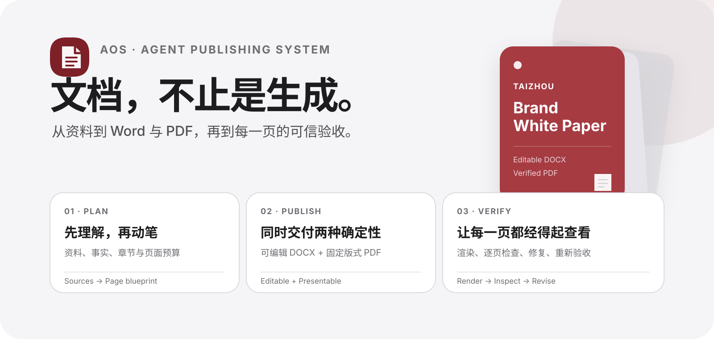

<div align="center">
  
  <h1>AOS Agent Skill · Document</h1>
  <p><strong>让 Agent 交付完成的文档，而不只是生成一个文件。</strong></p>
  <p>规划内容 · 创建或修改 Word · 导出 PDF · 逐页检查 · 清理公开发布信息</p>
  <p>
    <a href="README.md">简体中文</a> ·
    <a href="README.en.md">English</a>
  </p>
  <p>
    <a href="https://github.com/axutse/aos-agent-skill-document/releases"></a>
    <a href="https://github.com/axutse/aos-agent-skill-document/actions/workflows/validate.yml"></a>
    <a href="LICENSE"></a>
  </p>
  <p><sub>当前版本 0.1.5 · 本地处理 · 无需额外 API Key · 中文 / English</sub></p>
</div>

---

**[先看成果](#先看成果)** · **[能力范围](#能力范围)** · **[选择 Skill](#选择-skill)** · **[3 分钟开始](#3-分钟开始)** · **[使用案例](#使用案例)** · **[完整教程](docs/getting-started.md)**

## 一眼看懂

`AOS Agent Skill · Document` 是面向 Codex 与兼容 Agent 的开源文档出版工作流。它把内容理解与本地文档工具组合成一条可验证链路：

```text
PLAN  →  AUTHOR  →  RENDER  →  INSPECT  →  REVISE  →  VERIFY
规划      制作       渲染        检查        修复        验收
```

<table>
  <tr>
    <td width="50%"><strong>完整交付</strong><br><sub>从资料与页面计划，到可编辑 DOCX、固定版式 PDF 和验收结论。</sub></td>
    <td width="50%"><strong>本地优先</strong><br><sub>不依赖外部转换服务；插件本身不需要 API Key。</sub></td>
  </tr>
  <tr>
    <td><strong>视觉验收</strong><br><sub>渲染全部页面，逐页检查缺字、裁切、重叠、断表、模糊和异常空白。</sub></td>
    <td><strong>公开发布</strong><br><sub>检查作者信息、评论、修订记录、个人元数据、隐私与常见密钥残留。</sub></td>
  </tr>
  <tr>
    <td><strong>中英双语</strong><br><sub>支持中文、英文，或两套独立版本；术语、数据和图表保持对齐。</sub></td>
    <td><strong>可重复制作</strong><br><sub>先验收一个样本，再按锁定的版式、章节和字段规则批量生成。</sub></td>
  </tr>
</table>

> 默认交付契约：**源资料检查 + 内容与页面计划 + 可编辑 DOCX + 固定版式 PDF + 全页视觉验收 + 公开发布检查**。如果只需要其中一部分，Skill 会按要求缩小范围。

## 先看成果

TAIZHOU 开源案例包含 20 页可编辑 DOCX、对应 PDF、完整联系表和可重复运行的生成器。下面只展示 6 张放大页面：封面、目录，以及企业架构、品牌组合、商品开发和用户旅程四张高信息量图表页。

<table>
  <tr>
    <td width="50%"><strong>首页 · 第 1 页</strong><br><sub>品牌主张与出版物层级</sub><br></td>
    <td width="50%"><strong>目录 · 第 3 页</strong><br><sub>章节结构与阅读路径</sub><br></td>
  </tr>
  <tr>
    <td><strong>企业架构 · 第 4 页</strong><br><sub>治理关系与职责结构</sub><br></td>
    <td><strong>品牌组合 · 第 7 页</strong><br><sub>多品牌定位矩阵</sub><br></td>
  </tr>
  <tr>
    <td><strong>商品开发 · 第 12 页</strong><br><sub>商品与材料工作流</sub><br></td>
    <td><strong>用户旅程 · 第 17 页</strong><br><sub>内容触点与运营闭环</sub><br></td>
  </tr>
</table>

[查看高清案例与复刻方法](examples/taizhou-white-paper/README.md) · [下载 149 页完整案例](https://github.com/axutse/aos-agent-skill-document/releases/tag/v0.1.5)

## 能力范围

| 范围 | 已实现能力 | 状态 |
|---|---|:---:|
| 内容规划 | 多资料读取、事实清单、章节结构、页面预算 | ✅ |
| Word | 新建或局部修改 DOCX，保留样式与可编辑结构 | ✅ |
| Word | 标题、目录、表格、图片、分节、页眉页脚、页码 | ✅ |
| PDF | 页数、尺寸、旋转、加密、链接、表单、元数据检查 | ✅ |
| 视觉验收 | DOCX/PDF 全页渲染、逐页检查、修复后重新验收 | ✅ |
| 公开发布 | 清理作者信息、评论、修订记录和个人元数据 | ✅ |
| 双语交付 | 中文、英文、两套独立中英文版本及术语对齐 | ✅ |
| 批量交付 | 先生成样本，确认后按统一规则批量制作 | ✅ |
| 开源案例 | 20 页可编辑样例、149 页完整案例、生成器、QA 图片 | ✅ |
| 本地处理 | 不需要额外 API Key，不上传到外部转换服务 | ✅ |

[查看完整功能条件与暂不支持范围](docs/feature-matrix.md)

### 清楚的边界

| 本项目负责 | 本项目不负责 |
|---|---|
| 规划、制作、转换、渲染、检查与修复文档 | 替代 Microsoft Word、Adobe Acrobat 或人工最终签审 |
| 保留已验证名称、数字、术语与原始含义 | 自动证明业务数字、事实来源、版权或商标授权 |
| 在依赖可用时执行完整页面验收 | 在缺少 LibreOffice / Poppler 时承诺完整渲染结果 |
| 本地处理并检查公开发布风险 | 未经授权把文件上传到外部模型或转换 API |

## 选择 Skill

| 入口 | 什么时候使用 | 主要输出 |
|---|---|---|
| `$aos-publish-document` | 从零制作白皮书、报告、提案、手册或品牌文档 | DOCX + PDF + 页面验收 |
| `$aos-author-word` | 新建、修改、修复或准备公开发布 Word | 可编辑 DOCX，可选 PDF |
| `$aos-process-pdf` | 检查、清理、渲染或验证现有 PDF | 处理后 PDF + 检查结果 |

同时需要 Word 与 PDF 时，优先使用 `$aos-publish-document`。它先完成并验证 DOCX，再转换和验证 PDF。三项 Skill 的完整路由规则见 [从安装到首次交付](docs/getting-started.md)。

## 3 分钟开始

### 1 · 安装

```bash
codex plugin marketplace add axutse/aos-agent-skill-document
```

然后在 Codex CLI 中输入 `/plugins`，从 `AOS Agent Skills` 来源安装 **AOS Agent Skill · Document**；在 ChatGPT 桌面端也可以打开 Plugins Directory，从同一来源安装。安装完成后新建一个 Codex 任务，使新的 Skill 元数据进入上下文。

安装流程依据 [OpenAI 插件使用说明](https://learn.chatgpt.com/docs/plugins) 和 [插件打包与 Marketplace 指南](https://developers.openai.com/plugins/build/plugins)。

### 2 · 准备输入

最低限度只需说明：

- 文档目标与受众；
- 原始资料所在文件或目录；
- 需要 DOCX、PDF，还是两者都要；
- 语言、页数、风格与截止要求。

资料较完整时，再提供品牌名称、章节清单、已验证数据、图片、Logo、颜色和不能改动的术语。

### 3 · 复制第一条指令

```text
使用 $aos-publish-document，读取我提供的全部资料，先给出章节与页面计划，
再制作一份 20 页左右的中文品牌白皮书。风格简洁、结论先行、留白充分。
输出可编辑 DOCX 和对应 PDF，清理个人元数据，并逐页检查字体、图片、表格、
页码、页眉页脚、裁切和重叠问题。经营数字如果未经验证，标记为企划模拟值。
```

### 4 · 验收结果

完整交付通常包括可编辑 DOCX、固定版式 PDF、结构与元数据检查结果、全页渲染验收结论；只有明确需要时才额外生成联系表或 QA 图片。

[打开完整入门教程](docs/getting-started.md) · [查看更新、卸载与故障排查](docs/getting-started.md#11-更新与卸载)

## 使用案例

<details>
<summary><strong>从零制作品牌白皮书</strong></summary>

```text
使用 $aos-publish-document，把资料目录中的品牌介绍、产品信息、组织架构和图片
整理为一份 24 页品牌白皮书。先输出目录和页面蓝图，确认信息来源，完成 DOCX 后
导出 PDF。每页只表达一个核心判断，并逐页完成视觉验收。
```

</details>

<details>
<summary><strong>修改现有 Word，不破坏原有结构</strong></summary>

```text
使用 $aos-author-word，修改这份 Word 的第 2、5、8 节。保留现有样式、页眉页脚、
目录和分页，只更新指定内容。修改后清理作者与修订元数据，渲染全部页面并报告变化。
```

</details>

<details>
<summary><strong>只读检查准备公开的 PDF</strong></summary>

```text
使用 $aos-process-pdf，检查这个 PDF 的页数、页面尺寸、旋转、加密、表单、链接和
元数据，渲染全部页面，找出缺字、模糊图片、裁切、重叠和异常空白页。不要改文件，
先给我问题清单和修复优先级。
```

</details>

<details>
<summary><strong>将内部报告整理为公开版本</strong></summary>

```text
使用 $aos-publish-document，把内部报告整理为可公开版本。删除评论、修订记录、个人
元数据、密钥和客户隐私，保留可公开内容，输出 DOCX 与 PDF，并生成公开前检查摘要。
```

</details>

<details>
<summary><strong>批量生成同版式报告</strong></summary>

```text
使用 $aos-publish-document，以已确认的参考文档为版式标准，读取数据目录中的项目资料，
按项目分别生成 DOCX 与 PDF。先生成一个样本并验收，再按锁定的章节、字号、间距、
表格和页码规则处理剩余项目。
```

</details>

[查看年度报告、提案、SOP、品牌规范与更多提示词](docs/usage-cookbook.md)

## TAIZHOU 开源案例

[`examples/taizhou-white-paper/`](examples/taizhou-white-paper/) 提供：

- `brief.json`：标题、受众、页数、品牌和模拟值规则；
- `style-pack.json`：颜色、字体层级、页面网格和编辑设计规则；
- `references/`：企业治理、多品牌、商品材料、视觉系统和页面蓝图；
- `generate_example.py`：从结构化资料生成 DOCX；
- `build_release.py`：生成、清理、转换、渲染并验证完整交付；
- `output/`：20 页 DOCX、PDF 与完整联系表；
- `assets/chapter-gallery/`：上方六张高清代表页面。

案例只使用 TAIZHOU、WANMIAN / 万棉尚品、GEERNA / 哥尔纳和 UIUP 架构。所有内置经营数字均标记为 `PLANNING ASSUMPTION / 企划模拟值`。

### 本地复现

```bash
python -m venv .venv
source .venv/bin/activate
pip install -r requirements.txt
python examples/taizhou-white-paper/build_release.py \
  --output-dir examples/taizhou-white-paper/output \
  --qa-dir /tmp/taizhou-example-qa
```

DOCX 渲染需要 LibreOffice，PDF 渲染需要 Poppler。

## 开发、发行与安全

```bash
python scripts/check_public_release.py --root .
pytest
```

- Codex Plugin 与 SkillHub 单 Skill 发行方式见 [SkillHub 发布说明](docs/skillhub-publishing.md)。
- 贡献前请阅读 [CONTRIBUTING.md](CONTRIBUTING.md)，安全问题请阅读 [SECURITY.md](SECURITY.md)。
- 不要提交凭据、私有合同、客户资料、身份信息或未获授权的字体文件。
- 曾经粘贴到聊天、终端、Issue 或提交历史的密钥，应立即在提供商处撤销并重新生成。

## License

- 代码、Skill、脚本和仓库文档：[MIT](LICENSE)
- `examples/taizhou-white-paper/`：[CC BY 4.0](LICENSE-CONTENT)
- 许可证不授予 TAIZHOU 或案例品牌的商标权
