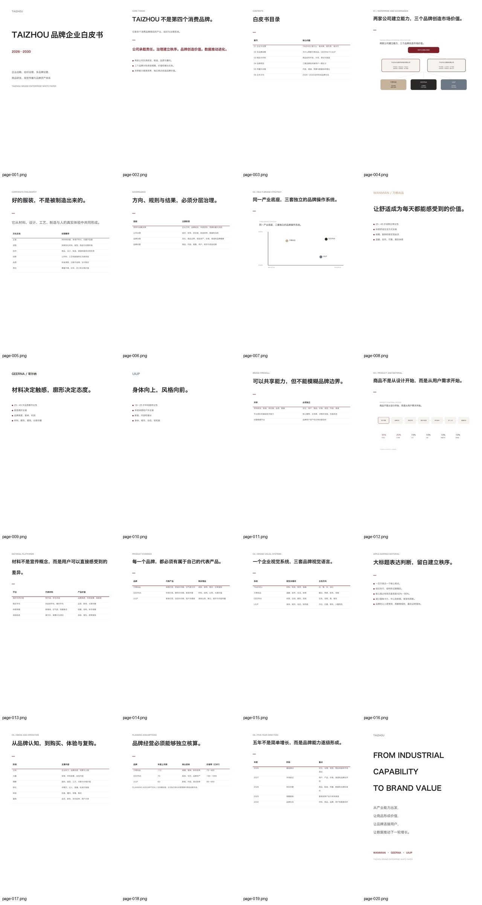
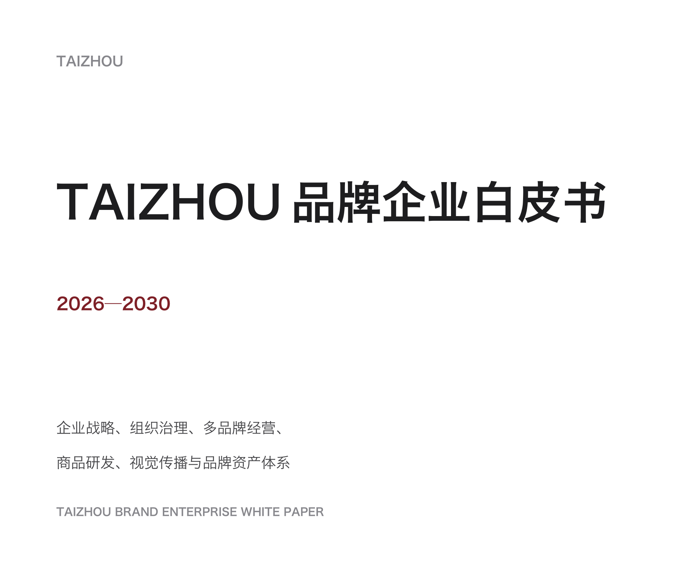
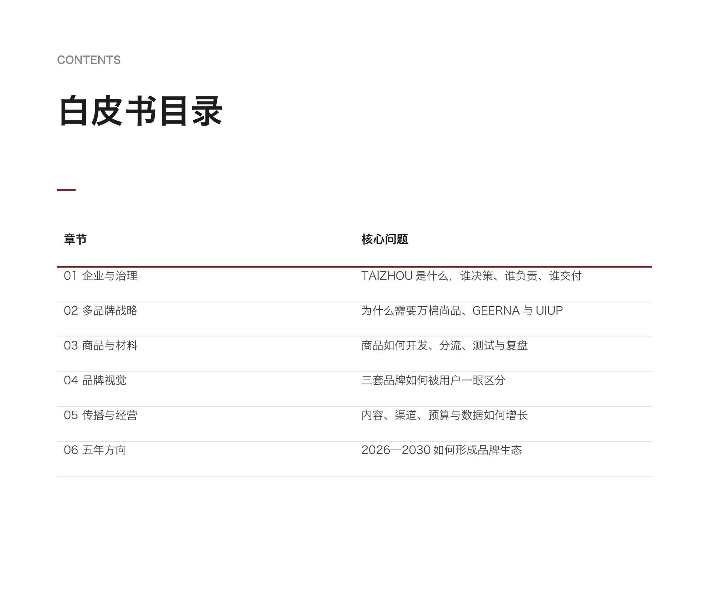
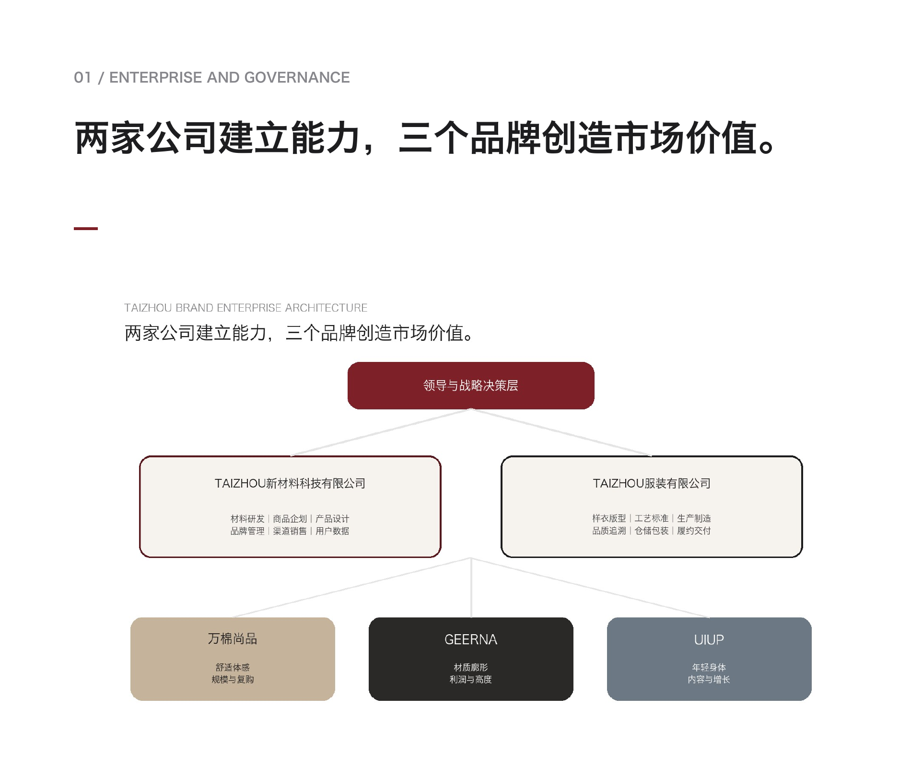
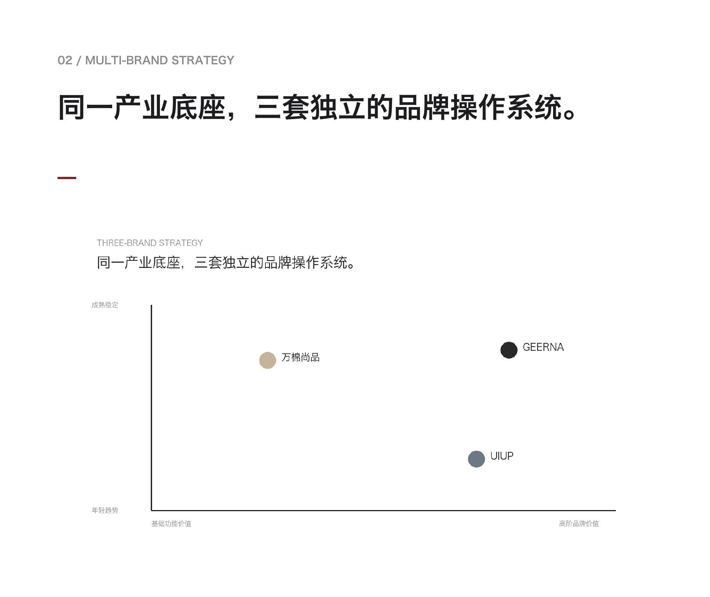
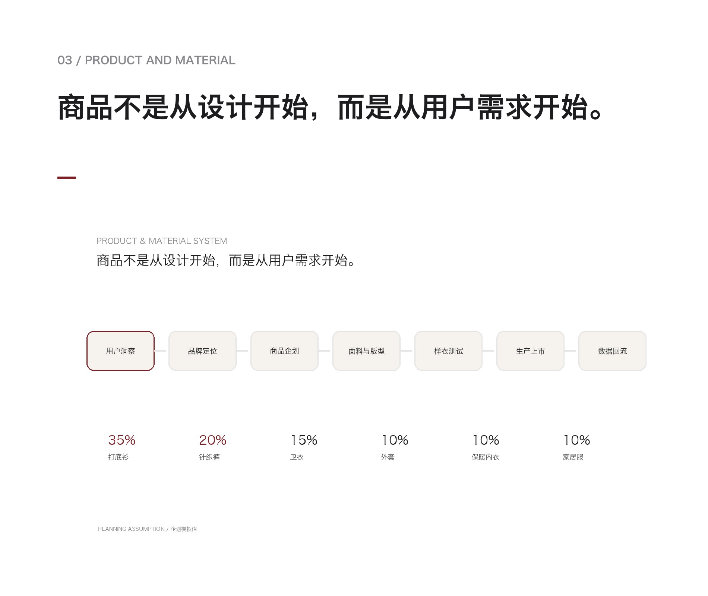
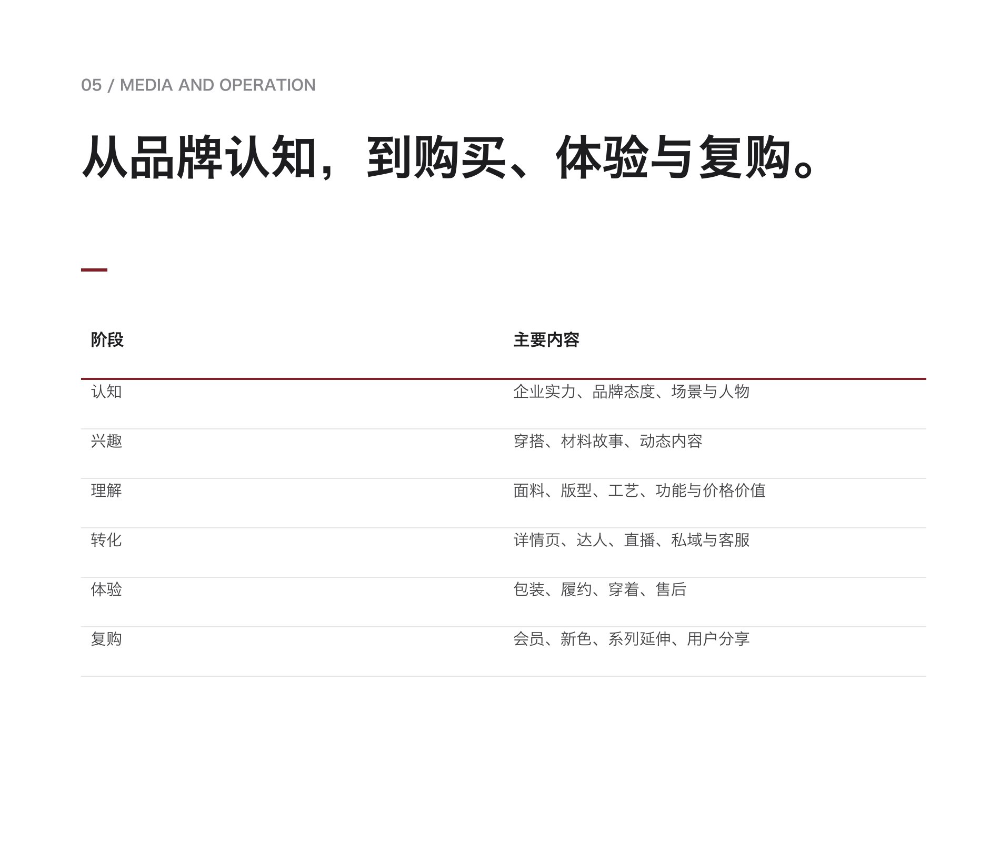

# TAIZHOU 品牌企业白皮书案例

[简体中文](README.md) | [English](README.en.md)

这是 `aos-agent-skill-document` 的公开、可重复生成案例。它演示如何把结构化 Brief、企业资料、品牌资料和 Style Pack 转换为可编辑 DOCX、固定版式 PDF，以及可供逐页检查的渲染结果。

案例采用 TAIZHOU 企业系统，以及 WANMIAN / 万棉尚品、GEERNA / 哥尔纳、UIUP 三品牌架构。所有经营数字、价格带、组织职责和增长目标均为 `PLANNING ASSUMPTION / 企划模拟值`，不能当作已验证企业事实。

## 案例交付

| 文件 | 用途 |
|---|---|
| `output/TAIZHOU品牌企业白皮书_示例版.docx` | 可编辑源文件，保留文本、表格和页面结构 |
| `output/TAIZHOU品牌企业白皮书_示例版.pdf` | 20 页固定版式公开示例 |
| `output/TAIZHOU品牌企业白皮书_示例版_联系表.jpg` | 一张图检查全部 20 页的节奏与一致性 |
| `assets/chapter-gallery/` | 封面、目录和四张高信息量图表代表页面 |

## 三种使用方式

### 1. 直接学习成品结构

先查看完整联系表，理解封面、目录、章节页、证据页、表格页与收尾页之间的节奏，再打开 DOCX 查看可编辑结构。



### 2. 把案例改成自己的品牌白皮书

修改 `brief.json` 和 `style-pack.json`，替换 `references/` 中的企业、品牌、商品和视觉资料，然后运行一键构建。不要只替换品牌名，应同步重写定位、用户、产品、价格、视觉和经营逻辑。

推荐指令：

```text
使用 $aos-publish-document，参考 TAIZHOU 案例的章节节奏和编辑设计，
但只使用我提供的新品牌资料。先建立事实清单与缺失项，再给出页面蓝图。
生成可编辑 DOCX 和对应 PDF，模拟值必须标注，全部页面完成渲染验收。
```

### 3. 复现完整发布流程

在仓库根目录运行：

```bash
python examples/taizhou-white-paper/build_release.py \
  --output-dir examples/taizhou-white-paper/output \
  --qa-dir /tmp/taizhou-example-qa
```

流程依次执行：

```text
生成 DOCX
-> 应用高清图片设置
-> 清理 DOCX 个人元数据
-> 渲染全部 Word 页面
-> 转换并清理 PDF 元数据
-> 渲染全部 PDF 页面
-> 生成联系表
-> 检查页数、尺寸、字体、表格和图片
```

如果只需要生成未经发布处理的源 DOCX：

```bash
python examples/taizhou-white-paper/generate_example.py \
  --brief examples/taizhou-white-paper/brief.json \
  --output /tmp/TAIZHOU-source.docx
```

## 六张代表页面

画廊严格保持 6 张：首页、目录，以及企业架构、品牌组合矩阵、商品开发系统和用户旅程四张图表页。所有图片都裁去下半页大面积空白，以 1900 × 1600 像素局部放大展示；原始 PDF 页面保持不变。

### 首页：第 1 页 / 白皮书封面

用最少信息明确文档名称、时间范围、内容边界和英文副标题，是完整案例的视觉入口。



### 目录：第 3 页 / 白皮书目录

展示六个核心章节及其需要回答的问题，适合作为读者导航和内容范围检查页。



### 图表 1：第 4 页 / 企业架构

同时呈现领导决策层、两家公司和三个品牌之间的层级关系，是治理章节中关系画面最完整的一页。



### 图表 2：第 7 页 / 品牌组合矩阵

用二维坐标区分万棉尚品、GEERNA 与 UIUP 的用户阶段和品牌价值，体现共享底座与独立定位。



### 图表 3：第 12 页 / 商品开发系统

把用户洞察、材料、商品企划、设计开发、价格、生产和上市连接为一条流程，并给出品类占比。



### 图表 4：第 17 页 / 用户旅程

从认知、兴趣、理解、转化、体验到复购，建立内容、渠道和用户阶段之间的对应关系。



## 输入文件如何协作

| 输入 | 负责回答的问题 | 建议修改时机 |
|---|---|---|
| `brief.json` | 文档叫什么、面向谁、多少页、输出什么 | 每个新项目开始时 |
| `style-pack.json` | 使用什么颜色、字号、间距与页面规则 | 确定视觉方向后 |
| `references/taizhou-governance.md` | 企业、组织和治理如何运作 | 企业事实确认后 |
| `references/taizhou-content-library.md` | 品牌、用户、商品、材料和经营内容 | 内容调研期间持续更新 |
| `references/taizhou-visual-system.md` | 企业与品牌如何被视觉区分 | 品牌资产确认后 |
| `references/taizhou-page-blueprint.md` | 完整版和精简版应包含哪些页面 | 正式排版前 |

## 换成自己的项目时修改什么

| TAIZHOU 案例字段 | 新项目应替换为 |
|---|---|
| 企业系统、公司和品牌关系 | 真实组织、责任边界与品牌组合 |
| 三个品牌定位 | 真实品牌定位、用户、价值与渠道 |
| 商品和材料平台 | 已验证产品、材料、工艺与证据 |
| 价格带和年度目标 | 经审批的数据，或明确标注模拟值 |
| 视觉关键词和颜色 | 获授权的 Logo、字体、颜色和图片 |
| 五年方向 | 有责任人、时间和指标的真实路线图 |

## 更多案例指令

### 先做内容诊断，再开始排版

```text
使用 $aos-publish-document，先审计资料是否足够支撑企业治理、多品牌战略、
商品材料、视觉、媒体经营和年度方向六个章节。列出事实、推断、模拟值和缺失项，
不要立即生成文档。资料确认后再给出 20 页页面蓝图。
```

### 保留版式，只更新内容

```text
使用 $aos-author-word，把 TAIZHOU 示例作为可编辑结构参考。保留页面尺寸、网格、
标题层级、表格样式和页脚逻辑，使用新资料重写正文。不要复制 TAIZHOU 的企业事实、
品牌定位或经营数据。完成后渲染全部页面并修复分页问题。
```

### 只检查 PDF 质量

```text
使用 $aos-process-pdf，检查 TAIZHOU 示例 PDF 的页面尺寸、元数据和全部 20 页画面，
重点检查中文字体、细线表格、浅色文字、图片清晰度和章节节奏。输出问题清单，
不要修改原文件。
```

### 扩展为 100 页以上完整版

```text
使用 $aos-publish-document，读取 taizhou-page-blueprint.md，把 20 页精简案例扩展为
100-130 页完整版。先建立章节页数预算与证据缺口清单；没有事实或图片支撑的页面
不得虚构，改为待补材料项。每完成一个章节就渲染检查，再合并最终 DOCX 和 PDF。
```

## 验收基线

- DOCX 和 PDF 都是 20 个 A4 页面；
- 页面顺序、标题和主要表格一致；
- DOCX 不包含评论、修订记录和个人作者残留；
- PDF 不加密、无 JavaScript、无表单和自定义元数据；
- 中文字体正常，无方框、裁切、重叠和异常空白页；
- 所有模拟经营数字都有明确标签；
- 代表页面只能用于快速浏览，最终交付仍需逐页检查。

案例内容按 CC BY 4.0 开放，商标权不在授权范围内。
